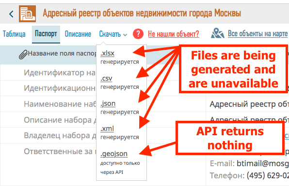
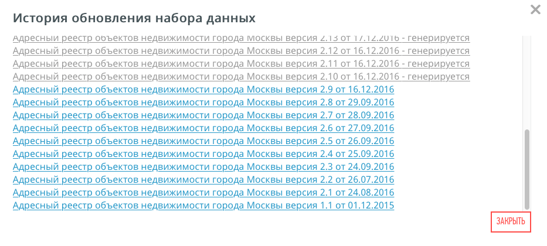
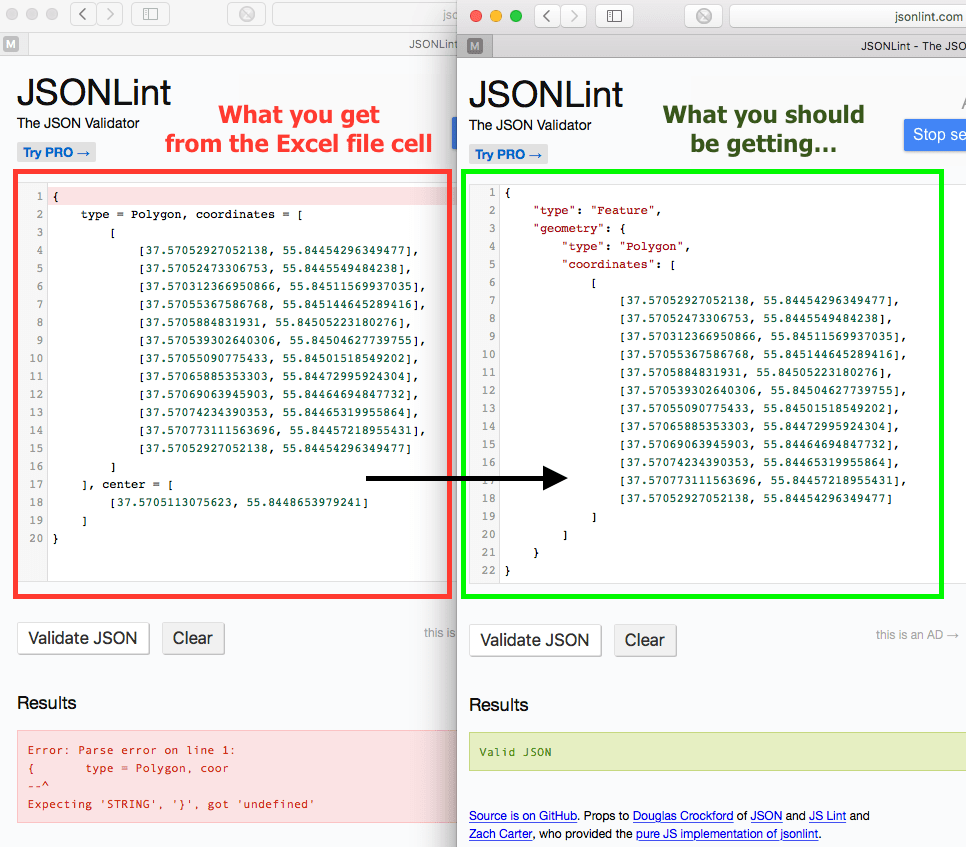
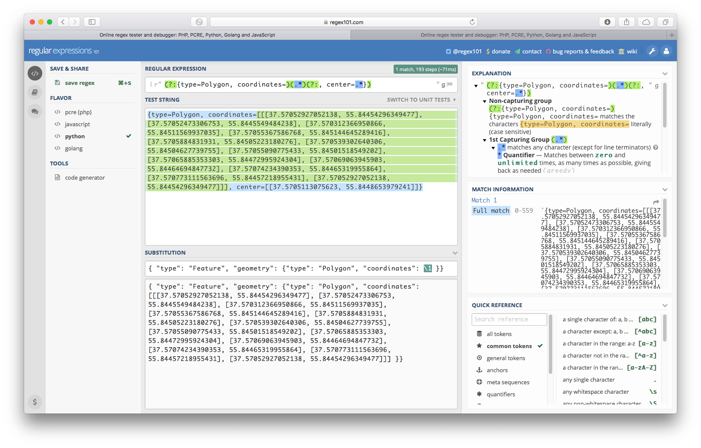
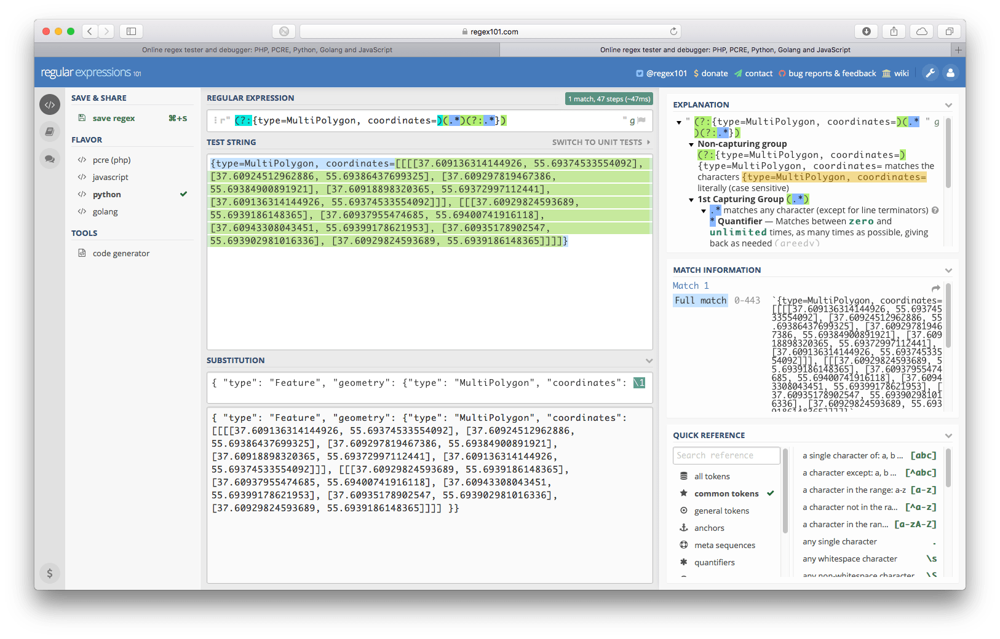

```{r set_options, echo=FALSE}
timer0 <- Sys.time() # set the timer
library("knitr")
opts_chunk$set(echo = TRUE)
opts_chunk$set(warning = FALSE)
```

# Introduction
A little more than a year ago I made a [post on fixing the non-compliant JSON/GeoJSON](http://ekotov.blogspot.ru/2015/12/converting-open-government-data-to.html) files from [data.mos.ru](http://data.mos.ru/Home/ChangeCulture?lang=en). Brief recap: the JSON/GeoJSON files with building polygons were not compliant with the standard, so they could not be read by default by software that expects standard JSON/GeoJSON. So back then I wrote a parser to fix the data and convert it to CSV with WKT encoded geometry in order to be able to load it into QGIS (or indeed any other GIS).

For a rather long period of time there were no issues and the data set was even fixed on the supplier side. But another problem struck in December 2016. The data was not updated any more. It seemed like a server-side issue, where new data set could not be properly pre-exported into a downloadable CSV/XLSX/JSON/XML file and API returned nothing.



If we dig a little deeper, we find out that this process of generating downloadable files and API-accessible data got stuck in some sort of an infinite loop since December 2016.




So what do we do? Thankfully, there is a backup version of the data set, but the problem is that it is in xlsx format, where geometry is stored in spreadsheet cells... So here we go again - fixing problems manually.


## Step 0 - Install and load required packages
```{r install_packages, results="hide", message=FALSE}
# first install missing packages
# thanks to Pratik Patil for the package installation code ( http://stackoverflow.com/a/29622385 )
# Specify the list of required packages to be installed and load  
Required_Packages = c("data.table", "readxl", "rgdal")

Install_And_Load <- function(Required_Packages) {
        Remaining_Packages <- Required_Packages[!(Required_Packages %in% installed.packages()[,"Package"])]
        
        if(length(Remaining_Packages)) 
        {
                install.packages(Remaining_Packages)
        }
        for(package_name in Required_Packages)
        {
                library(package_name, character.only = T, quietly = F)
        }
}


Install_And_Load(Required_Packages) # Call the function to install packages
```


## Step 1 - Get the data
We find [the last working link](http://op.mos.ru/EHDWSREST/catalog/export/get?id=86337) (data set version 2.9 dating back to 2016-12-16) and download the data set from the Moscow Government open data website. Save it as a temporary file, read the data from the zip archive and then remove the temporary file.

```{r get_data, results = "hide", message = FALSE}
if( file.exists('data-4277-2016-12-16.xlsx') == F ) {
download.file("http://op.mos.ru/EHDWSREST/catalog/export/get?id=86337", 'data-4277-2016-12-16.zip',
              mode = "wb") # download the dataset and save it to a temporary archive
unzip(zipfile = 'data-4277-2016-12-16.zip') # extract the temporary archive
unlink('data-4277-2016-12-16.zip') # remove the temporary archive
}
x <- data.table(read_excel('data-4277-2016-12-16.xlsx')) # read the data into a data.table
```

Comment: I use [`data.table`](http://r-datatable.com) for speed and convenience of data manipulation most of the time. You may prefer other tools.

## Step 2 - Explore the data and identify the cleaning strategies
Let us see how bad the situation is with those geometries in the spreadsheet cells. Print the first cell with geoData:
```{r view_data_1}
x[ 1, geoData, ]
```

You can copy-paste that string into a JSON validation service (e.g. at [http://jsonlint.com](http://jsonlint.com)) and try to validate it. As you will see, it cleans up the string a little bit, but there are still some errors. Now we should compare what we have with what we want to have in order to be able to successfully convert the thing into a spatial object. Let's look at the GeoJSON standard (e.g. at [http://geojson.org/geojson-spec.html](http://geojson.org/geojson-spec.html)). We will see the dramatic difference between the two, but nothing unfixable.

Here is a comparison of the code that we have (formatted by [http://jsonlint.com](http://jsonlint.com)) and the code that we want to have:


So we need to perform a series of character string transformations. We will be using regular expressions to manipulate the text and perform the required substitutions.

## Step 3 - Have a more detailed look at the data
Now I've had experience with this data set so I know that it not only contains Polygons, but also so-called MultiPolygons. So here is task 1 - work with these two separately as the stings for them are different.

Have a look, here is the number of entries with each polygon type:
```{r view_data_2}
x[ geoData %like% 'type=Polygon', .N, ]
x[ geoData %like% 'type=MultiPolygon', .N, ]
```

And here are the snippets of what they look like:
```{r view_data_3}
x[ geoData %like% 'type=Polygon', geoData, ][1]
x[ geoData %like% 'type=MultiPolygon', geoData, ][1]
```

As you can see these are clearly different. Now one might want to construct a universal regular expression for both of these, but I see little point in doing that (though perhaps it would speed up the processing, but it's not critical with the data set of this size). So we are going to be constructing separate regular expressions (or **RegExps**) for these. They will be nearly identical except for the word Polygon.

Now there is another problem which you probably would not notice (and to be honest I haven't at first). Have a look at the end of the string of the polygon feature printed above. In the end it has `center=...`. What is that? This may be some clever way of storing the polygon centroid alongside the polygon itself, but GeoJSON standard does not seem to support that kind of feature. So this part of the string needs to go.

ThereYet another problem, which you would certainly notice very late and spend about an hour debugging (I have...). Not every feature has this `center=...` thing. So you need to account for that too.

And if all that was not enough, there are some features that simply don't have any geometry, and one feature with such complicated geometry, that the string simply did not fit into the xlsx cell size limit.

```{r view_long_string}
x[ ! (geoData %like% 'Polygon' | is.na(geoData)) , geoData, ] # too long string, so there's actually an error message in the cell
```

So to summarize:
```{r data_view_summary}
x[ geoData %like% 'type=Polygon' & geoData %like% 'center=', .N, ] # Polygons with centroids
x[ geoData %like% 'type=MultiPolygon' & geoData %like% 'center=', .N, ] # MultiPolygons with centroids
x[ geoData %like% 'type=Polygon' & ! geoData %like% 'center=', .N, ] # Polygons without centroids
x[ geoData %like% 'type=MultiPolygon' & ! geoData %like% 'center=', .N, ] # MultiPolygons without centroids
x[ is.na(geoData) , .N, ] # objects with no geometry
x[ ! (geoData %like% 'Polygon' | is.na(geoData)) , .N, ] # too long string
```
 
## Step 4 - Process the data
Now let us construct the regular expressions for the four cases above. We will simply drop the objects that have no geometry, as obviously they are unrecoverable.

I won't go into the details on how you construct the RegExps. I will simply show my examples for the two of the cases. I usually use [https://regex101.com](https://regex101.com) or [http://www.regexr.com](http://www.regexr.com).

### RegExp for Polygons with centroids





RegExp: `(?:{type=Polygon, coordinates=)(.*)(?:, center=.*})`

Substitution: `{ "type": "Feature", "geometry": {"type": "Polygon", "coordinates": \1 }}`

### RegExp for MultiPolygons without centroids





RegExp: `(?:{type=MultiPolygon, coordinates=)(.*)(?:.*})`

Substitution: `{ "type": "Feature", "geometry": {"type": "MultiPolygon", "coordinates": \1 }}`

### Back to R - process the strings

First let us remove the entries that have no geometry:
```{r remove_no_geom_entries}
x <- x[ geoData %like% 'Polygon' ]
```


Now these expressions must be slightly edited for use in R's `gsub()` function. Special characters must be escaped by two back-slashes (`\\`).

Let's look at the R code (execution make take quite some time, as RegExp matching is quite a heavy task):
```{r apply_regexps, results='hide', message=F}
# convert Polygons with center data
x[ geoData %like% 'type=Polygon' & geoData %like% 'center=',
   geoDataJSON := paste0('{ "type": "Feature",', '"properties": { "unom": "', UNOM,
                         gsub(pattern = '(?:\\{type=Polygon, coordinates=)(.*)(?:, center=.*)(\\})',
                          replacement = '" \\}, "geometry": \\{"type": "Polygon", "coordinates": \\1 \\}\\}',
   x = geoData)), ]

# convert MultiPolygons with center data
x[ geoData %like% 'type=MultiPolygon' & geoData %like% 'center=',
   geoDataJSON := paste0('{ "type": "Feature",', '"properties": { "unom": "', UNOM,
                        gsub(pattern = '(?:\\{type=MultiPolygon, coordinates=)(.*)(?:, center=.*)(\\})',
                         replacement = '" \\}, "geometry": \\{"type": "MultiPolygon", "coordinates": \\1 \\}\\}',
   x = geoData)), ]
        
# convert Polygons without center data
x[ geoData %like% 'type=Polygon' & ! geoData %like% 'center=',
   geoDataJSON := paste0('{ "type": "Feature",', '"properties": { "unom": "', UNOM,
                         gsub(pattern = '(?:\\{type=Polygon, coordinates=)(.*)(?:.*\\})',
                          replacement = '" \\}, "geometry": \\{"type": "Polygon", "coordinates": \\1 \\}\\}',
   x = geoData)), ]
        
# convert MultiPolygons without center data
x[ geoData %like% 'type=MultiPolygon' & ! geoData %like% 'center=',
   geoDataJSON := paste0('{ "type": "Feature",', '"properties": { "unom": "', UNOM,
                         gsub(pattern = '(?:\\{type=MultiPolygon, coordinates=)(.*)(?:.*\\})',
                          replacement = '" \\}, "geometry": \\{"type": "MultiPolygon", "coordinates": \\1 \\}\\}',
   x = geoData)), ]
```

Notice, that I have not reused the substitution pattern as it has been initially designed using [https://regex101.com](https://regex101.com). I've broken it down in two parts and added a more complex `paste0()` routine that also adds a unique identifier from the data set (it's called `UNOM` - look for it in the code), so that we not only get the geometry, but also those identifiers so that we can attach the data back to the spatial data set that we are about to create from those fixed GeoJSON strings.

### Paste the strings together and convert to spatial object

Now each object in our table has a proper (hopefully!) GeoJSON string in the `geoDataJSON` column. It would be a pain to convert these one by one with `readOGR()` as it is rather slow. We need to paste all the objects into a one large GeoJSON and read them with `readOGR()` on one go. That will save us literally hours!

Try reading just one object and see how much time it takes:
```{r fake_read_speed_1, message=F, results='hide', echo=T, eval=F}
system.time(xs_temp <- readOGR(x[1, geoDataJSON], 'OGRGeoJSON'))
```

```{r real_read_speed_1, message=F, results='hide', echo=T}
st1 <- system.time(xs_temp <- readOGR(x[1, geoDataJSON], 'OGRGeoJSON'))
```

```{r real_read_speed_1_print, message=F, results='asis', echo=F}
st1
```

Now try looping through, say, 10 entries one by one:
```{r loop_time_test, results='hide'}
timer1 <- Sys.time() # set the timer
for (i in 1:10) {
        xs_temp <- readOGR(x[i, geoDataJSON], 'OGRGeoJSON')
}
timer1 <- timetaken(timer1) # stop the timer
```

```{r print_timer_1}
timer1 # print the time taken
```

So that's about a second per entry on my hardware, your mileage may vary. That's slow, especially when you have 150k entries, as it would take 150k seconds which is 41+ hours!

So how do we paste all that together to do everything in one go? Well, we read the GeoJSON standard a bit more and come up with a way to collapse all the individual GeoJSON strings together so that they are recognizable by the importers of GIS software, R, Python or Julia.

```{r cat_string}
spcat <- paste0('{"type": "FeatureCollection","crs": {"type": "name","properties": {"name": "urn:ogc:def:crs:OGC:1.3:CRS84"}},"features": [',
                paste(x$geoDataJSON, collapse = ','),
                ']}')
```

No we have a large character string vector:
```{r string_size}
paste0(object.size(spcat) / 10^6 , ' Mb')
```

### Create a spatial object

Now that we have this magic character vector, we can use it just as if we had a *.geojson file and read it with `readOGR()` function from `rgdal` package.

```{r fake_read_speed_2, message=F, results='hide', echo=T, eval=F}
system.time( sp <- readOGR( spcat, 'OGRGeoJSON') )
```

```{r real_read_speed_2, message=F, results='hide', echo=T, eval=T}
st2 <- system.time( sp <- readOGR( spcat, 'OGRGeoJSON') )
```

```{r real_read_speed_2_print, message=F, results='asis', echo=F}
st2
```


This process should be taking around 100-200 seconds, depending on your hardware. But that's obviously much faster then 150k seconds if we were to to that one polygon at a time.

## Let us have a look at our processed data
```{r check_spdf_properties}
proj4string(sp) # coordinate system is WGS84, because we specified that in our GeoJSON string above with "crs": {"type": "name","properties": {"name": "urn:ogc:def:crs:OGC:1.3:CRS84"}}
str(sp, max.level = 2) # spatial dataset structure
str(sp@data) # attribute table structure
```

Oops, our `unom` is now a `factor`, while it is `character` in the original data set. We could have avoided that using `stringsAsFactors = F` parameter/argument in the `readOGR()` function. But all right, let's fix it post–factum:
```{r convert_unom_data_type}
sp@data$unom <- as.character(sp@data$unom)
```

Now let us merge back the columns from the original data set (and don't forget to drop the columns with geometry):
```{r merge_attribute_table}
spdf <- merge(sp,
              x[ , .SD, .SDcols = -c('geoData', 'geoDataJSON')],
              by.x = 'unom', by.y = 'UNOM')
str(spdf@data)
```

Last check that the merge is successful. Let's check some random row in the initial data set and in our final spatial data.frame:
```{r check_merge_results}
x[ 100 , .SD, .SDcols = c('UNOM', 'NDOC', 'DDOC', 'NREG', 'DREG')]
spdf@data[ 100 , c('unom', 'NDOC', 'DDOC', 'NREG', 'DREG')]
```

Try plotting the data:
```{r plot_spdf}
plot(spdf)
```

Save the data for future use, e.g. into a shape-file and into a binary *.rds file
```{r save_files, eval=F}
setCPLConfigOption('SHAPE_ENCODING', 'UTF-8')
writeOGR(spdf, driver = 'ESRI Shapefile', dsn = getwd(), layer = 'adr', layer_options ='ENCODING="UTF-8"', overwrite_layer = T)

saveRDS(spdf, 'adr_spatial.rds')
```


```{r stop_timer_0, echo=FALSE, results='hide'}
timer0 <- timetaken(timer0) # stop the timer
```

# Finale

It is a pity data sets at [data.mos.ru](http://data.mos.ru/Home/ChangeCulture?lang=en) are sometimes broken and the problems are not taken care of for long periods of time. Hopefully things will get better and we will get even more interesting data sets.

Meanwhile, you can either follow my example - download the data and follow the steps to fix it (if the link to the source xlsx file is dead, you can get it [here](https://cloud.mail.ru/public/MAqt/XVDhrLzpz)). Or you can just download the results of my fix [here](https://cloud.mail.ru/public/EX27/UkKLr6nBQ). Also everything you need is in a github repository at [https://github.com/e-kotov/r_data_mos_ru_address_registry_fix_v2_2017](https://github.com/e-kotov/r_data_mos_ru_address_registry_fix_v2_2017). [Link to the blogpost](http://ekotov.blogspot.com/2017/02/fixing-open-data-with-r-case-of-moscow.html).

# Tech info

- CPU: 3.2 GHz Intel Core i5 4570
- RAM: 16 GB 1600 MHz DDR3
- Packages: `data.table` is compiled from source with OpenMP support, `rgdal` is compiled from source with GDAL from [KyngChaos](http://www.kyngchaos.com/software/frameworks)


Session info:
```{r session_info}
sessionInfo()
```

It took `r timer0` to generate this post using [R Markdown](http://rmarkdown.rstudio.com/index.html) (excluding the time to download and extract the data).

